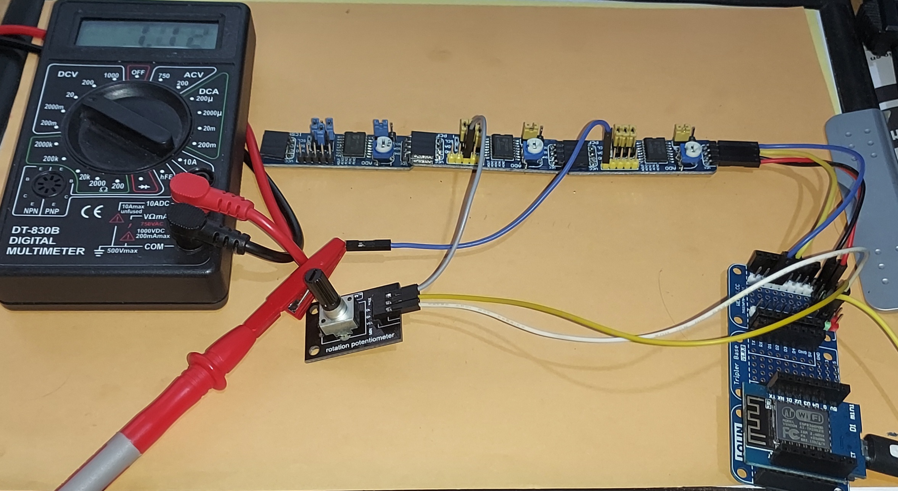

# MultiPCF8591

<p align="center">
  
</p>

Librería Arduino para gestionar varios **PCF8591** mediante I²C desde una única clase. Está pensada para ofrecer una API sencilla para proyectos con Arduino, ESP8266 y ESP32, sin depender de librerías externas específicas del PCF8591.

La comunicación se realiza directamente mediante `Wire.h` y la clase `TwoWire`, por lo que el usuario puede seleccionar el bus I²C que corresponda a su plataforma.


## Características

- Hasta 8 PCF8591 en un mismo bus I²C, según las direcciones configuradas por A0, A1 y A2.
- API basada en una única clase `MultiPCF8591`.
- ADC de 8 bits.
- 4 entradas ADC en modo single-ended.
- Lectura secuencial de los cuatro canales en una sola secuencia de lectura I²C.
- DAC de 8 bits.
- Selección de los cuatro modos de entrada definidos por el PCF8591.
- Direcciones configurables por módulo.
- Detección individual de módulos.
- Soporte para una instancia de `TwoWire`.
- Sin dependencia de librerías PCF8591 de terceros.
- Sin memoria dinámica.
- Compatible con Arduino, ESP8266 y ESP32.

## ¿Qué es el PCF8591?

El PCF8591 es un conversor de adquisición de datos con:

- cuatro entradas analógicas;
- un DAC de 8 bits;
- interfaz I²C;
- multiplexor de entradas;
- cuatro configuraciones de entrada analógica;
- selección de dirección mediante tres pines hardware A0/A1/A2.

El dispositivo trabaja con una alimentación de 2,5 V a 6,0 V y utiliza VREF/AGND como referencia para las conversiones. El rango de entrada analógica es relativo a VSS/VDD o a la referencia configurada según el circuito. Consulta siempre la hoja de datos y las características de tu módulo antes de conectar señales.

Fuente técnica principal: [NXP PCF8591 datasheet](https://www.nxp.com/docs/en/data-sheet/PCF8591.pdf).

## Instalación

### Arduino IDE

1. Descarga este repositorio.
2. Copia la carpeta `MultiPCF8591` dentro de tu directorio `libraries`.
3. Reinicia el Arduino IDE.
4. Abre `Examples -> MultiPCF8591 -> Basic`.

También puede instalarse desde el ZIP de un repositorio GitHub mediante **Sketch -> Include Library -> Add .ZIP Library...**.

### PlatformIO

Copia el proyecto en tu árbol de librerías o añádelo como dependencia de tu proyecto según el flujo habitual de PlatformIO.

## Conexión básica

Los pines principales son:

| PCF8591 | Función |
|---|---|
| SDA | Datos I²C |
| SCL | Reloj I²C |
| A0/A1/A2 | Selección de dirección |
| VDD | Alimentación |
| VSS | Masa digital |
| AGND | Masa analógica |
| VREF | Referencia ADC/DAC |
| AIN0..AIN3 | Entradas analógicas |
| AOUT | Salida DAC |

SDA y SCL necesitan las resistencias pull-up apropiadas para el bus.

## Ejemplo básico

```cpp
#include <Wire.h>
#include <MultiPCF8591.h>

MultiPCF8591 io(3, 0x48);

void setup() {
    Serial.begin(115200);

    Wire.begin();

    if (!io.begin()) {
        Serial.println("Uno o mas PCF8591 no responden");
    }
}

void loop() {
    uint8_t value = io.analogRead(0, 0);

    Serial.print("ADC0 modulo 0: ");
    Serial.println(value);

    delay(250);
}
```

`begin()` comprueba cada dirección configurada. No bloquea esperando a que aparezca un dispositivo: si una dirección no responde, `moduleFound()` simplemente será `false`.

## Varios módulos

El constructor:

```cpp
MultiPCF8591 io(3, 0x48);
```

crea tres módulos inicialmente con:

```text
module 0 -> 0x48
module 1 -> 0x49
module 2 -> 0x4A
```

Las direcciones no tienen que permanecer consecutivas. Pueden cambiarse:

```cpp
io.setAddress(1, 0x4D);
io.setAddress(2, 0x4F);
```

Por ejemplo:

```text
module 0 -> 0x48
module 1 -> 0x4D
module 2 -> 0x4F
```

La librería rechaza direcciones fuera del rango PCF8591 y evita duplicar direcciones entre los módulos administrados.

## Gestión de módulos

```cpp
io.moduleCount();
io.address(0);
io.validModule(0);
io.moduleFound(0);
```

Ejemplo:

```cpp
for (uint8_t i = 0; i < io.moduleCount(); ++i) {
    Serial.print("Modulo ");
    Serial.print(i);
    Serial.print(": ");

    if (io.moduleFound(i)) {
        Serial.println("OK");
    } else {
        Serial.println("NO ENCONTRADO");
    }
}
```

## ADC

Para leer un canal concreto:

```cpp
uint8_t value = io.analogRead(0, 2);
```

El primer argumento es el módulo y el segundo el canal.

En el modo `SINGLE_ENDED`:

```text
channel 0 -> AIN0
channel 1 -> AIN1
channel 2 -> AIN2
channel 3 -> AIN3
```

### Una particularidad importante del PCF8591

El PCF8591 **no entrega directamente en el primer byte de una lectura el resultado de la conversión que acaba de iniciar**. Al comenzar un ciclo de lectura, la conversión se dispara y el primer byte transmitido corresponde al resultado de la conversión anterior.

Por este motivo `analogRead()` realiza la secuencia necesaria y descarta el primer byte:

```text
WRITE:
    address + control byte

READ:
    byte 0 -> conversión anterior (se descarta)
    byte 1 -> conversión solicitada
```

Esto es intencionado y es necesario para que la API devuelva el valor correcto del canal solicitado.

## Lectura de los cuatro ADC

Para el modo `SINGLE_ENDED`:

```cpp
uint8_t values[4];

if (io.readAll(0, values)) {
    Serial.println(values[0]);
    Serial.println(values[1]);
    Serial.println(values[2]);
    Serial.println(values[3]);
}
```

`readAll()` utiliza el **auto-incremento de canal** del PCF8591.

En lugar de hacer cuatro lecturas independientes, la librería hace una escritura del control byte y una lectura secuencial:

```text
READ:
    byte 0 -> conversión anterior
    byte 1 -> AIN0
    byte 2 -> AIN1
    byte 3 -> AIN2
    byte 4 -> AIN3
```

Por tanto, `readAll()` es considerablemente más adecuado para muestrear los cuatro canales que llamar cuatro veces a `analogRead()`.

`readAll()` está definido para `SINGLE_ENDED`. En los modos diferenciales el número y significado de los canales cambian, por lo que se evita dar una interpretación artificial de cuatro valores.

## Canales virtuales

La librería incluye una forma sencilla de tratar los ADC single-ended como una colección lineal:

```cpp
uint8_t value = io.analogRead(4);
```

Con tres módulos:

```text
Módulo 0: virtual 0..3
Módulo 1: virtual 4..7
Módulo 2: virtual 8..11
```

Por ejemplo:

```cpp
io.analogRead(0);   // módulo 0, AIN0
io.analogRead(4);   // módulo 1, AIN0
io.analogRead(11);  // módulo 2, AIN3
```

Esta API está pensada principalmente para `SINGLE_ENDED`. Si utilizas entradas diferenciales, es preferible usar explícitamente `analogRead(module, channel)`.

## Modos de entrada

El PCF8591 dispone de cuatro configuraciones:

```cpp
io.setInputMode(0, MultiPCF8591::SINGLE_ENDED);
io.setInputMode(0, MultiPCF8591::DIFFERENTIAL_3);
io.setInputMode(0, MultiPCF8591::MIXED);
io.setInputMode(0, MultiPCF8591::DIFFERENTIAL_2);
```

### SINGLE_ENDED

Cuatro entradas:

```text
AIN0
AIN1
AIN2
AIN3
```

Es el modo recomendado para la API de cuatro ADC independientes.

### DIFFERENTIAL_3

Tres entradas diferenciales definidas por el hardware del PCF8591.

### MIXED

Configuración mixta single-ended/diferencial definida por el dispositivo.

### DIFFERENTIAL_2

Dos entradas diferenciales.

En los modos diferenciales el resultado ADC utiliza representación de complemento a dos, por lo que un valor devuelto por `analogRead()` debe interpretarse de acuerdo con el modo seleccionado.

## DAC

El PCF8591 tiene un único DAC por módulo.

```cpp
io.analogWrite(0, 128);
```

activa la salida analógica del módulo 0 y escribe `128` en su registro DAC.

Con varios módulos:

```cpp
io.analogWrite(0, 128);
io.analogWrite(1, 255);
io.analogWrite(2, 0);
```

Cada módulo constituye un canal DAC independiente.

El DAC utiliza la referencia `VREF`; no debe interpretarse el valor `128` como una tensión universal de 2,5 V. La tensión real depende de VREF, AGND, carga, tolerancias y características del dispositivo.

## Control byte

Para aplicaciones avanzadas:

```cpp
io.writeControl(0, controlByte);
```

El PCF8591 utiliza un byte de control donde se seleccionan:

- habilitación de la salida analógica;
- modo de entrada;
- auto-incremento;
- canal ADC.

Los bits reservados se mantienen a cero por la librería.

También puede consultarse el estado mantenido por la instancia:

```cpp
uint8_t control = io.controlByte(0);
```

La función de bajo nivel no sustituye la comprensión de la hoja de datos: permite acceder al registro de control, pero el significado de cada combinación depende del modo del dispositivo.

## Direcciones I²C

El PCF8591 tiene tres entradas hardware A0, A1 y A2. La dirección de 7 bits es:

```text
1001 A2 A1 A0
```

Por ello las direcciones disponibles son:

```text
0x48 ... 0x4F
```

Hay ocho combinaciones posibles.

Esto significa que **tres módulos consecutivos no son una limitación del PCF8591**. La librería comienza con direcciones consecutivas por comodidad, pero permite reasignarlas mediante `setAddress()`.

No es posible tener más de ocho PCF8591 con las mismas direcciones en un mismo bus sin utilizar hardware adicional como un multiplexor I²C.

## PCF8591P y PCF8591T

`PCF8591P` y `PCF8591T` corresponden principalmente a diferentes encapsulados del mismo dispositivo: DIP16 y SO16, respectivamente.

La librería no distingue entre ellos porque el protocolo I²C y la organización funcional relevante para esta API son los mismos.

NXP identifica además variantes de ordenación como `PCF8591T/2`; cualquier montaje concreto debe comprobar su hoja de datos y condiciones eléctricas.

## ESP8266

La librería no fija los GPIO de I²C.

Por ejemplo:

```cpp
#include <Wire.h>
#include <MultiPCF8591.h>

MultiPCF8591 io(3, 0x48);

void setup() {
    Wire.begin(D2, D1);

    if (!io.begin()) {
        Serial.println("Error PCF8591");
    }
}
```

Los pines deben corresponder a la placa/core ESP8266 que estés utilizando.

## ESP32

El mismo principio permite utilizar los GPIO que hayas elegido:

```cpp
#include <Wire.h>
#include <MultiPCF8591.h>

MultiPCF8591 io(3, 0x48, Wire);

void setup() {
    Wire.begin(21, 22);
    io.begin();
}
```

Para un segundo controlador I²C de un ESP32 compatible con el core, se puede proporcionar otra instancia de `TwoWire`:

```cpp
TwoWire MyBus = TwoWire(1);
MultiPCF8591 io(3, 0x48, MyBus);
```

La inicialización del bus sigue siendo responsabilidad del sketch.

## API completa

### Constructor

```cpp
MultiPCF8591(uint8_t moduleCount,
             uint8_t firstAddress = 0x48,
             TwoWire &wire = Wire);
```

### Inicialización y módulos

```cpp
bool begin();
uint8_t moduleCount() const;
uint8_t address(uint8_t module) const;
bool setAddress(uint8_t module, uint8_t address);
bool validModule(uint8_t module) const;
bool moduleFound(uint8_t module) const;
bool ping(uint8_t module);
```

### ADC

```cpp
uint8_t analogRead(uint8_t module, uint8_t channel);
uint8_t analogRead(uint8_t virtualChannel);
bool readAll(uint8_t module, uint8_t values[4]);
```

### Modos de entrada

```cpp
bool setInputMode(uint8_t module, InputMode mode);
InputMode inputMode(uint8_t module) const;
```

Modos:

```cpp
MultiPCF8591::SINGLE_ENDED
MultiPCF8591::DIFFERENTIAL_3
MultiPCF8591::MIXED
MultiPCF8591::DIFFERENTIAL_2
```

### DAC

```cpp
bool analogWrite(uint8_t module, uint8_t value);
```

### Control de bajo nivel

```cpp
bool writeControl(uint8_t module, uint8_t controlByte);
uint8_t controlByte(uint8_t module) const;
```

## Rendimiento I²C

La arquitectura de esta librería intenta evitar trabajo innecesario sin ocultar una propiedad importante del PCF8591: cada lectura ADC implica una conversión cuyo resultado se entrega de forma pipeline.

`analogRead(module, channel)` utiliza:

```text
1 escritura del control
1 lectura de 2 bytes
```

El primer byte se descarta y el segundo es el resultado solicitado.

`readAll(module, values)` utiliza:

```text
1 escritura del control
1 lectura de 5 bytes
```

y obtiene los cuatro canales single-ended consecutivos en una única secuencia de lectura.

El PCF8591 especifica que la tasa máxima de conversión viene determinada por la velocidad real del bus I²C. Aumentar la frecuencia del bus no elimina la latencia de la conversión ni los tiempos analógicos del dispositivo.

## Errores

La librería no utiliza excepciones.

Las operaciones que pueden fallar devuelven `bool` cuando esto aporta información:

```cpp
if (!io.readAll(0, values)) {
    // Error I2C o módulo no disponible
}
```

Las lecturas que devuelven directamente un `uint8_t` utilizan `0` como valor de error. Por este motivo, si necesitas distinguir inequívocamente entre un ADC que mide `0` y un error de comunicación, utiliza:

```cpp
if (!io.moduleFound(0)) {
    // tratar error
}
```

o `readAll()`, que devuelve `bool`.

Si un módulo deja de responder, la librería marca ese módulo como no encontrado y continúa con el resto del programa.

## Consideraciones eléctricas

El PCF8591 admite una alimentación de 2,5 V a 6,0 V según la hoja de datos. Esto **no significa que cualquier módulo comercial basado en PCF8591 sea eléctricamente intercambiable a cualquier tensión**.

Especialmente al conectar un PCF8591 a un ESP8266/ESP32:

- comprueba la tensión de pull-up de SDA/SCL;
- comprueba la alimentación del módulo;
- comprueba la tensión máxima admisible por las entradas del microcontrolador;
- comprueba la referencia VREF;
- conecta AGND correctamente;
- evita introducir señales fuera del rango permitido.

La hoja de datos recomienda desacoplar adecuadamente la alimentación y la referencia y cuidar especialmente el layout para reducir ruido y crosstalk.

## Referencia ADC y DAC

La tensión convertida no debe deducirse únicamente del valor digital.

En el caso single-ended ideal:

```text
VLSB = (VREF - VAGND) / 256
```

La tensión real también depende de errores de offset, ganancia, linealidad, alimentación, referencia y condiciones de carga.

## Limitaciones

- Máximo de 8 direcciones PCF8591 nativas por bus.
- El PCF8591 es un ADC de 8 bits; no se proporciona falsa resolución mediante conversiones artificiales.
- `readAll()` está optimizado para `SINGLE_ENDED`.
- La librería no configura automáticamente SDA/SCL.
- La librería no proporciona una referencia de tensión externa: ésta pertenece al hardware.
- No se ocultan las particularidades del pipeline de conversión del PCF8591.
- No se incluye soporte para multiplexores I²C externos en esta versión.

## Ejemplo de aplicación

Un proyecto con tres módulos puede organizarse así:

```cpp
#include <Wire.h>
#include <MultiPCF8591.h>

MultiPCF8591 io(3, 0x48);

void setup() {
    Serial.begin(115200);
    Wire.begin();

    io.setAddress(1, 0x4D);
    io.setAddress(2, 0x4F);

    if (!io.begin()) {
        Serial.println("Hay modulos ausentes");
    }

    io.analogWrite(0, 128);
}

void loop() {
    uint8_t values[4];

    for (uint8_t module = 0; module < io.moduleCount(); ++module) {
        if (!io.moduleFound(module)) {
            continue;
        }

        if (io.readAll(module, values)) {
            Serial.print("M");
            Serial.print(module);
            Serial.print(": ");

            for (uint8_t channel = 0; channel < 4; ++channel) {
                Serial.print(values[channel]);
                Serial.print(channel == 3 ? '\n' : '\t');
            }
        }
    }

    delay(100);
}
```

## Diseño

El diseño sigue una idea deliberadamente sencilla:

```text
MultiPCF8591
    |
    +-- módulo 0 -> dirección I²C
    +-- módulo 1 -> dirección I²C
    +-- módulo 2 -> dirección I²C
    +-- ...
```

La clase mantiene únicamente el estado necesario por módulo:

- dirección;
- control byte;
- estado de presencia.

No se crean objetos dinámicos para cada dispositivo y no se requiere una clase PCF8591 adicional.


## Roadmap

Posibles extensiones futuras:

- API explícita para lectura diferencial con tipos de resultado apropiados.
- Métodos de lectura ADC con estado/pipeline para aplicaciones de muestreo intensivo.
- Configuración avanzada de referencia.
- Métodos de diagnóstico I²C.
- Ejemplos específicos para ESP8266 y ESP32.
- Soporte opcional para arquitecturas con multiplexor I²C externo.

Las futuras versiones deberían conservar la API básica siempre que sea posible.

## Licencia

Este proyecto puede distribuirse bajo una licencia open source compatible con el ecosistema Arduino. La licencia concreta debe quedar fijada por el repositorio antes de publicar la versión definitiva.

## Referencias

- NXP, **PCF8591 8-bit A/D and D/A converter**, Product Data Sheet Rev. 7, 27 June 2013.
- NXP, documentación de producto PCF8591.

## Nota sobre el estado del componente

La página actual de NXP marca el PCF8591 como **End of Life / No Longer Manufactured** en sus distintas presentaciones. La librería se mantiene orientada a módulos PCF8591 que ya existan en proyectos, stocks disponibles y diseños compatibles.

## Licencia de uso de la documentación

La documentación técnica del PCF8591 pertenece a su fabricante. Este README describe el protocolo y el uso del componente con fines de desarrollo y no sustituye la hoja de datos del fabricante.

# Autor

Jordi Orts 2026
